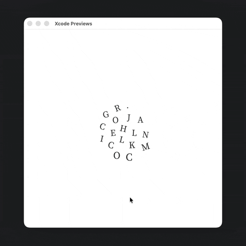

<p align="left">
  
</p>
[English](README.md) · **简体中文**

一个轻量的 SwiftUI 字体管理库：把项目里导入的任何字体文件，用一行修饰符直接渲染。

```swift
Text("hello").anyFontUse(size: 24, weight: 100)     // CSS 风格数值
Text("hello").anyFontUse(size: 24, weight: .thin)   // 语义命名
```

[](https://swift.org)
[](https://swift.org/package-manager)

[](LICENSE)

---

## 应用场景



## 特性

- **零配置**：把字体拖进 Target，库自动扫描 Bundle 并注册——不用写 `register(...)`，不用动 `Info.plist`，连 `App.init()` 都不用碰。SwiftUI Preview 直接生效。
- 一行修饰符调用，写法和 SwiftUI 原生 `.font()` 风格一致。
- 权重同时支持 **数值字面量**（`100`, `400`, `700`…）和 **语义命名**（`.thin`, `.regular`, `.bold`…），与 CSS / SwiftUI `Font.Weight` 对齐。
- 多字族：`.anyFontFamily("Inter")` 在视图子树内切换默认字族；`anyFontUse(..., family: "JetBrains Mono")` 局部覆盖。
- 自动识别字族 + 权重：优先读 OS/2 表的 `usWeightClass`（CSS 标准），回退到 PostScript 名 / CT trait，三级兜底。
- 仍可手动 `register(...)` 精细控制——会覆盖自动识别。
- 权重就近匹配：只有 3 档时传 500，自动落到最近的已注册权重。
- 没注册时优雅回退到系统字体，不让 UI 崩。
- 纯 Swift，零三方依赖；支持 Swift 6 严格并发。

## 安装

### Swift Package Manager

在 Xcode 里：`File > Add Packages…`，粘贴仓库地址即可。

或者在 `Package.swift` 中：

```swift
dependencies: [
    .package(url: "https://github.com/jackcring/AnyFontUse.git", from: "1.0.0")
],
targets: [
    .target(
        name: "YourApp",
        dependencies: ["AnyFontUse"]
    )
]
```

最低部署版本：

| Platform | Min  |
| -------- | ---- |
| iOS      | 15.0 |
| macOS    | 12.0 |
| tvOS     | 15.0 |
| watchOS  | 8.0  |
| visionOS | 1.0  |

## 快速开始（零配置）

### 1. 把字体文件加进项目

把 `.ttf` / `.otf` 文件拖进你的 App target，确认 **Target Membership** 勾上你的 App。

> 不用配 `Info.plist` 的 `UIAppFonts`，也不用写任何注册代码。

### 2. 直接用

```swift
import AnyFontUse
import SwiftUI

struct ContentView: View {
    var body: some View {
        VStack(spacing: 12) {
            Text("hello").anyFontUse(size: 24, weight: 100)
            Text("hello").anyFontUse(size: 24, weight: .thin)
            Text("hello").anyFontUse(size: 24, weight: .regular)
            Text("hello").anyFontUse(size: 24, weight: .bold)
        }
    }
}
```

第一次调用 `.anyFontUse(...)` 时，库会自动扫描 `Bundle.main` 里的所有字体文件，
读取它们的字族名 + 权重（优先用 OS/2 表的 `usWeightClass`，回退到 PostScript 名 / CT trait），
全部注册并建立索引。SwiftUI Preview 也直接生效，不需要 `App.init()`。

> 项目里只有一个字族时，它会自动成为默认字族；多字族时若需指定，写一行：
>
> ```swift
> AnyFontManager.shared.defaultFamily = "Inter"
> ```

## 多字族怎么区分？

### 方法一：用 `family:` 参数（最直白）

```swift
Text("正文").anyFontUse(size: 16, family: "Inter")
Text("代码").anyFontUse(size: 16, family: "JetBrains Mono")
```

### 方法二：用 `.anyFontFamily(...)` 修饰符在视图层切换（推荐）

跟 SwiftUI 的 `.foregroundStyle(_:)`、`.font(_:)` 一个套路，整棵子树共享：

```swift
ContentView()
    .anyFontFamily("Inter")        // 整个 App 默认 Inter
```

```swift
VStack {
    Text("Hello world")            // 用 Inter
        .anyFontUse(size: 18)

    Text("let x = 42")             // 局部覆盖到 JetBrains Mono
        .anyFontUse(size: 16, family: "JetBrains Mono")

    HStack {
        Text("a"); Text("b"); Text("c")
    }
    .anyFontFamily("Playfair Display")   // 只这个 HStack 用 Playfair
    .anyFontUse(size: 20)
}
.anyFontFamily("Inter")
```

### 解析优先级

字族按下面顺序解析（从高到低）：

1. `anyFontUse(..., family: "...")` 显式传入；
2. 视图链上最近的 `.anyFontFamily("...")`；
3. `AnyFontManager.shared.defaultFamily`（默认值，自动模式下会自动选权重最丰富的字族）。

### 不知道字族叫什么？

```swift
print(AnyFontManager.shared.registeredFamilies)
// ["Inter", "JetBrains Mono", "Playfair Display"]
```

把这行扔到 `.onAppear { ... }` 里跑一次就清楚了。字族名取自字体文件元数据（一般跟在 macOS 「Font Book」里看到的一样）。

## 自动扫描的细节

- **触发时机**：首次调用 `.anyFontUse(...)`、`registeredFamilies`、`registeredWeights(in:)` 时；只跑一次。
- **扫描范围**：默认 `[Bundle.main]`。如果字体打包在某个 SPM 资源里，启动早期加上：
  ```swift
  AnyFontManager.shared.autoBootstrapBundles = [.main, .module]
  ```
- **支持格式**：`.ttf`、`.otf`、`.ttc`、`.otc`。
- **权重识别优先级**：
  1. OS/2 表的 `usWeightClass`（仅文件里只有一个 face 时使用，最权威，对齐 CSS 100~900）；
  2. PostScript 名关键字（`Thin` / `ExtraLight` / `Bold` / `ExtraBold` ...）；
  3. CoreText 的 `kCTFontWeightTrait` 归一值，按就近映射到 100~900。
- **斜体处理**：识别到斜体后**不会**进入字族 / 权重索引（避免 `weight: .regular` 误命中斜体）。但文件已被注册，仍可用 `Font.custom("...-Italic", size:)` 直接取用。
- **关闭自动模式**：
  ```swift
  AnyFontManager.shared.autoBootstrapEnabled = false
  ```

## 调试

```swift
print(AnyFontManager.shared.registeredFamilies)
print(AnyFontManager.shared.registeredWeights(in: "JetBrains Mono"))
```

如果某个字体没识别到，控制台会有 `[AnyFontUse] ...` 字样的日志。

## 显式注册（可选）

如果你需要：

- 自定义字族名（不想用文件里的原始名）；
- 修正自动识别错的权重；
- 从非 `Bundle.main` 的资源 bundle 加载；

那就显式注册——会**覆盖**自动识别的同名条目：

```swift
AnyFontManager.shared.register(
    family: "Mixed",
    weights: [
        .regular: AnyFontResource(fileName: "Mixed-Regular", fileExtension: "ttf"),
        .bold:    AnyFontResource(
            fileName: "Mixed-Bold",
            fileExtension: "otf",
            postScriptName: "MixedDisplay-Bold" // 显式指定，跳过自动嗅探
        ),
    ]
)
```

### 注册多个字族

可以重复调用 `register(family:…)` 注册任意多个字族；首个注册的会自动成为默认字族（除非你显式设置）。

```swift
AnyFontManager.shared.register(family: "Inter", weights: […])
AnyFontManager.shared.register(family: "PlayfairDisplay", weights: […])
AnyFontManager.shared.defaultFamily = "Inter"
```

### 注册单个字体文件

只有一个字体、不需要权重映射时：

```swift
let psName = AnyFontManager.shared.registerSingleFont(fileName: "MyIcon", fileExtension: "ttf")
// 用返回的 PostScript 名直接 .font(.custom(psName!, size: 24))
```

### 从 SPM 资源 Bundle 注册

如果字体打包在另一个 SPM 的资源里，传入对应 bundle：

```swift
AnyFontManager.shared.register(
    family: "Brand",
    weights: [.regular: "Brand-Regular", .bold: "Brand-Bold"],
    bundle: .module
)
```

### 权重就近匹配

只注册了 `.regular` (400) 和 `.bold` (700)？传任何中间值都能用，会落到最近的：

```swift
Text("auto").anyFontUse(size: 16, weight: 500) // → 实际用 .regular(400)
Text("auto").anyFontUse(size: 16, weight: 600) // → 实际用 .bold(700)
```

## 权重对照表

`AnyFontWeight` 和 CSS / SwiftUI `Font.Weight` 一致：

| 数值 | 语义命名      | SwiftUI 回退  |
| ---: | ------------- | ------------- |
|  100 | `.ultraLight` | `.ultraLight` |
|  200 | `.thin`       | `.thin`       |
|  300 | `.light`      | `.light`      |
|  400 | `.regular`    | `.regular`    |
|  500 | `.medium`     | `.medium`     |
|  600 | `.semibold`   | `.semibold`   |
|  700 | `.bold`       | `.bold`       |
|  800 | `.heavy`      | `.heavy`      |
|  900 | `.black`      | `.black`      |

> 你也可以传入任意 1~1000 的数值，会按上表区间映射到最近的语义。

## 常见问题

**Q: 为什么我看到的字体没变？**
A: 检查两点：1) 字体文件确实勾选了 App target 的 Membership；2) 文件能被 `Bundle.main.urls(forResourcesWithExtension:)` 找到。控制台没看到 `[AnyFontUse] 字体注册失败` 时，调用 `AnyFontManager.shared.registeredFamilies` 看一下识别到了什么。

**Q: SwiftUI Preview 里也能用吗？**
A: 能。自动扫描在「首次调用 `anyFontUse`」时触发，跟 `App.init()` 没关系，Preview 一样会跑。

**Q: 我不想要自动注册，全部手动控制。**
A: `AnyFontManager.shared.autoBootstrapEnabled = false`，然后显式调 `register(...)` 即可。

**Q: 我不知道字体的 PostScript 名怎么办？**
A: 不用知道，全程库自动嗅探。

**Q: 跟直接用 `Font.custom(_:size:)` 比有什么区别？**
A: 不用记 PostScript 名，不用配 `Info.plist`，按权重数值 / 语义统一调用，没注册时有系统字体兜底。

**Q: 性能？**
A: 自动扫描只跑一次（首次查询），之后只是字典查表 + `NSLock`。

## 贡献

欢迎 PR、issue。修改前请先跑一遍：

```bash
swift build
```

## License

MIT License，详见 [LICENSE](LICENSE)。

## Author

**Jc** © [jackcirng.com](https://jackcirng.com)
